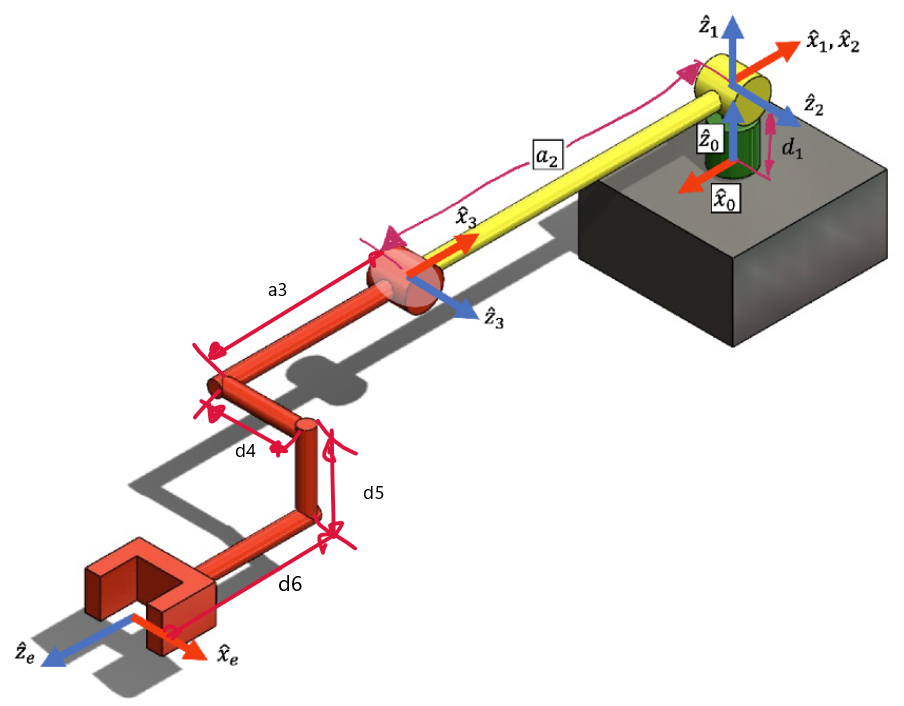

# FRA333_HW3_6509_6523
## เเสดงขั้นตอน เเนวคิดของการตรวจคำตอบเเละผลลัพธ์ของการตรวจสอบ
สร้าง MDH Parameters จาก roboticstoolbox เพื่อเช็คกับคำตอบที่เราคำนวณเอง


```bash
DHRobot: 3DOF_Robot, 3 joints (RRR), dynamics, modified DH parameters
┌────────┬───────┬────────────┬────────┐
│  aⱼ₋₁  │ ⍺ⱼ₋₁  │     θⱼ     │   dⱼ   │
├────────┼───────┼────────────┼────────┤
│    0.0 │  0.0° │  q1 + 180° │ 0.0892 │
│    0.0 │ 90.0° │         q2 │    0.0 │
│ -0.425 │  0.0° │         q3 │    0.0 │
└────────┴───────┴────────────┴────────┘

┌──────┬─────────────────────────────────────────────────┐
│ tool │ t = -0.47, -0.093, 0.11; rpy/xyz = 0°, -90°, 0° │
└──────┴─────────────────────────────────────────────────┘
```

จากนั้นประกาศตัวแปร q_init ที่เป็น joint config ต่างๆ และตัวแปร w_init ที่เป็น wrench ของแขนกล
```py
q_init = [0.0, 0.0, 0.0] # [q1, q2, q3]
w_init = [10.0, 0.0, 0.0, 0.0, 0.0, 0.0] # [fx, fy, fz, Nx, Ny, Nz]
```
ต่อมาเช็คเพื่อความแน่ใจว่า FK ที่สร้างเองจาก roboticstoolbox กับ FK จาก FKHW3 ของทางผู้ผลิตตรงกันหรือไม่
```py
print('FK ของ roboticstoolbox')
print(robot.fkine(q_init))
print('FK ของ FKHW3')
R,P,R_e,p_e = FKHW3(q_init)
print(SE3.Rt(R_e, p_e))
```
จะได้ผลลัพธ์ดังนี้
```bash
FK ของ roboticstoolbox
   0         0         1         0.8994
   1         0         0         0.109
   0         1         0        -0.0038
   0         0         0         1

FK ของ FKHW3
   0         0         1         0.8994
   1         0         0         0.109
   0         1         0        -0.0038
   0         0         0         1
```
จากคำตอบที่ได้แสดงว่า FK ของ roboticstoolbox ที่สร้างเองสามารถใช้ได้ ดังนั้นสามารถนำไปใช้ตรวจคำตอบต่างๆได้
## ตรวจคำตอบข้อที่ 1
ตรวจว่าฟังก์ชั่น Jacobian ที่คำนวณเองนั้นตรงกับของ roboticstoolbox หรือไม่

**ฟังก์ชั่น Jacobian ที่คำนวณเอง**
```py
def endEffectorJacobianHW3(q:list[float])->list[float]:
    # Forward Kinematic
    R,P,R_e,p_e = FKHW3(q)
    # create empty matrix for add Jacobian
    J = np.zeros([6, len(q)]) # matrix 6x3
    # Find Jacobian
    for i in range(len(q)):
        P_i = P[:,i] # Position from {0} to {i} 
        Z_i = R[:, 2, i] # Rotation z axis of each joint
        J[:3, i] = R_e.transpose() @ (np.cross(Z_i, p_e - P_i))  # Add Linear Jacobian from row 1 to row 3 that reference {e}
        J[3:, i] = R_e.transpose() @ Z_i # Add Angular Jacobian from row 4 to row 6
    return J
```
นำคำตอบจากที่คำนวณเองมาเปรียบเทียบกัน
```py
J_HW3 = endEffectorJacobianHW3(q_init)

# Set precision for easier comparison
np.set_printoptions(precision=4, suppress=True)

print('Jacob_HW3:')
print(J_HW3) # แสดงคำตอบของฟังก์ชัน jacobian ที่ได้จากการคำนวณ
print('Jacob_RTB:')
print(robot.jacobe(q_init)) # แสดงคำตอบที่ได้จาก robotictoolsbox
```
ได้คำตอบดังนี้
```bash
Jacob_HW3:
[[ 0.8994 -0.     -0.    ]
 [-0.     -0.8994 -0.4744]
 [-0.109  -0.093  -0.093 ]
 [ 0.      1.      1.    ]
 [ 1.     -0.     -0.    ]
 [-0.      0.      0.    ]]
Jacob_RTB:
[[ 0.8994  0.      0.    ]
 [-0.     -0.8994 -0.4744]
 [-0.109  -0.093  -0.093 ]
 [ 0.      1.      1.    ]
 [ 1.      0.      0.    ]
 [ 0.      0.      0.    ]]
```
จะเห็นได้ว่าฟังก์ชัน jacobian ที่ได้จากคำนวณเองและจาก robotictoolsbox ตรงกัน **แสดงว่าฟังก์ชัน jacobian ที่ได้จากคำนวณเองถูกต้อง**

## ตรวจคำตอบข้อที่ 2
