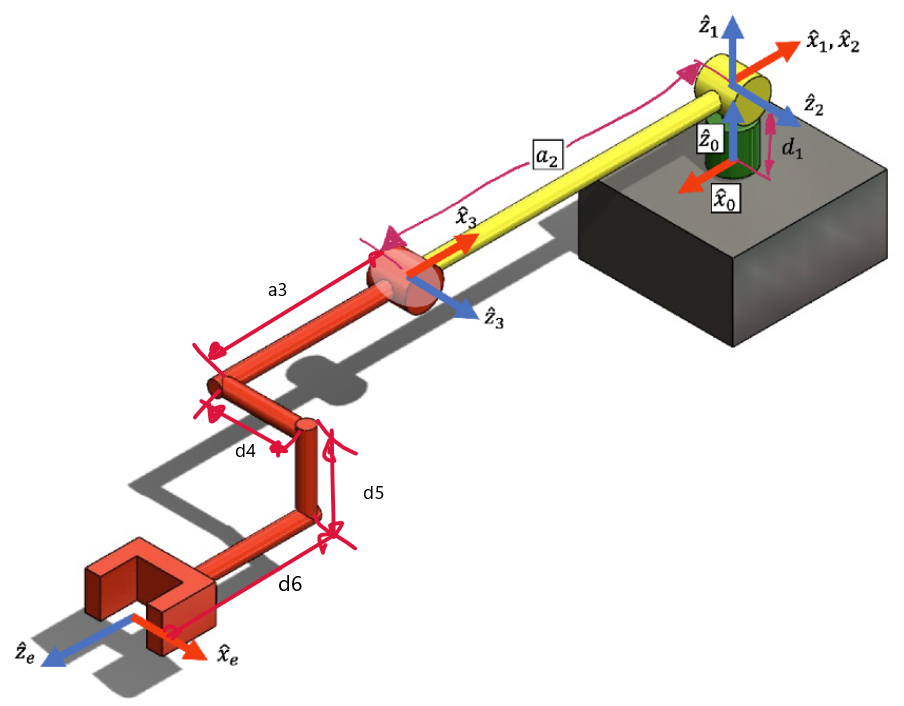
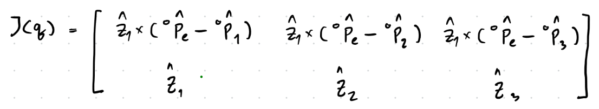
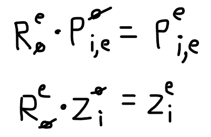
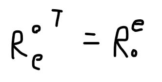
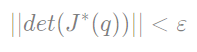
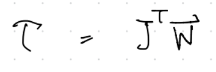
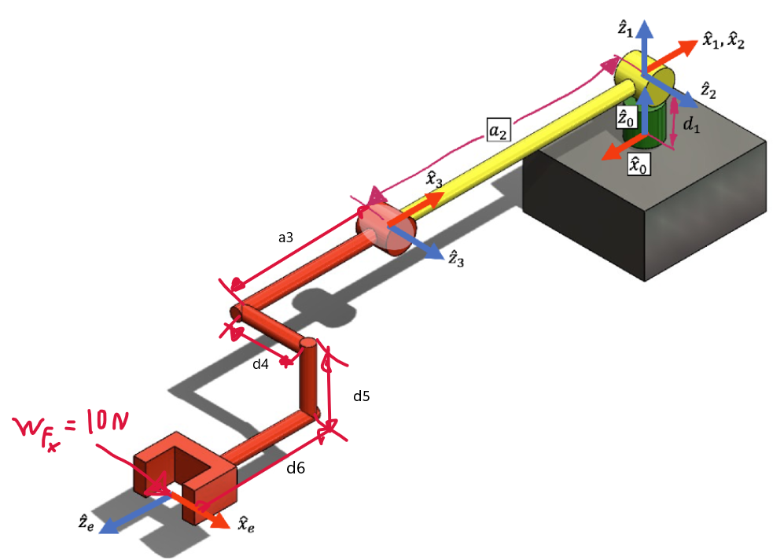

# FRA333_HW3_6509_6523
## เเสดงขั้นตอน เเนวคิดของการตรวจคำตอบเเละผลลัพธ์ของการตรวจสอบ
สร้าง MDH Parameters จาก roboticstoolbox เพื่อเช็คกับคำตอบที่เราคำนวณเอง

ระบุความยาวของ link ต่างๆ
```py
d_1 = 0.0892
a_2 = 0.425
a_3 = 0.39243
d_4 = 0.109
d_5 = 0.093
d_6 = 0.082
```
หา MDH Parameters จาก roboticstoolbox
```py
robot = rtb.DHRobot(
    [
        rtb.RevoluteMDH(alpha = 0.0     ,a = 0.0      ,d = d_1    ,offset = pi ),
        rtb.RevoluteMDH(alpha = pi/2    ,a = 0.0      ,d = 0.0    ,offset = 0.0),
        rtb.RevoluteMDH(alpha = 0.0     ,a = -a_2     ,d = 0.0    ,offset = 0.0),
    ],
    tool = SE3([
    [0, 0, -1, -(a_3 + d_6)],
    [0, 1, 0, -d_5],
    [1, 0, 0, d_4],
    [0, 0, 0, 1]]),
    name = "3DOF_Robot"
)
```
แสดงตาราง MDH Parameters
```bash
DHRobot: 3DOF_Robot, 3 joints (RRR), dynamics, modified DH parameters
┌────────┬───────┬────────────┬────────┐
│  aⱼ₋₁  │ ⍺ⱼ₋₁  │     θⱼ     │   dⱼ   │
├────────┼───────┼────────────┼────────┤
│    0.0 │  0.0° │  q1 + 180° │ 0.0892 │
│    0.0 │ 90.0° │         q2 │    0.0 │
│ -0.425 │  0.0° │         q3 │    0.0 │
└────────┴───────┴────────────┴────────┘

┌──────┬─────────────────────────────────────────────────┐
│ tool │ t = -0.47, -0.093, 0.11; rpy/xyz = 0°, -90°, 0° │
└──────┴─────────────────────────────────────────────────┘
```

จากนั้นประกาศตัวแปร q_init ที่เป็น joint config ต่างๆ และตัวแปร w_init ที่เป็น wrench ของแขนกล
```py
q_init = [0.0, 0.0, 0.0] # [q1, q2, q3]
w_init = [0.0, 0.0, 0.0, 0.0, 0.0, 0.0] # [fx, fy, fz, Nx, Ny, Nz]
```
ต่อมาเช็คเพื่อความแน่ใจว่า FK ที่สร้างเองจาก roboticstoolbox กับ FK จาก FKHW3 ของทางผู้ผลิตตรงกันหรือไม่
```py
print('FK ของ roboticstoolbox')
print(robot.fkine(q_init))
print('FK ของ FKHW3')
R,P,R_e,p_e = FKHW3(q_init)
print(SE3.Rt(R_e, p_e))
```
จะได้ผลลัพธ์ดังนี้
```bash
FK ของ roboticstoolbox
   0         0         1         0.8994
   1         0         0         0.109
   0         1         0        -0.0038
   0         0         0         1

FK ของ FKHW3
   0         0         1         0.8994
   1         0         0         0.109
   0         1         0        -0.0038
   0         0         0         1
```
จากคำตอบที่ได้แสดงว่า FK ของ roboticstoolbox ที่สร้างเองสามารถใช้ได้ ดังนั้นสามารถนำไปใช้ตรวจคำตอบต่างๆได้
## ตรวจคำตอบข้อที่ 1
ตรวจว่าฟังก์ชั่น Jacobian ที่คำนวณเองนั้นตรงกับของ roboticstoolbox หรือไม่

**ฟังก์ชั่น Jacobian ที่คำนวณเอง**

โดยคำนวณจากสูตร


ซึ่งถ้าทำตามสูตรจะได้ jacobian ที่เทียบเฟรม 0 ดังนั้นต้องคูณ Rotation ที่เฟรม 0 เทียบเฟรม e กับส่วนของ linear jacobian และ angular jacobian เพื่อที่จะได้ jacobian ที่เทียบเฟรม e



โดย Rotation ที่เฟรม 0 เทียบเฟรม e หาจากเอา Rotation ที่เฟรม e เทียบเฟรม 0 มา transpose ดังภาพ



ซึ่งเขียนเป็นฟังก์ชันดังนี้
```py
def endEffectorJacobianHW3(q:list[float])->list[float]:
    # Forward Kinematic
    R,P,R_e,p_e = FKHW3(q)
    # create empty matrix for add Jacobian
    J = np.zeros([6, len(q)]) # matrix 6x3
    # Find Jacobian
    for i in range(len(q)):
        P_i = P[:,i] # Position from {0} to {i} 
        Z_i = R[:, 2, i] # Rotation z axis of each joint
        J[:3, i] = R_e.transpose() @ (np.cross(Z_i, p_e - P_i))  # Add Linear Jacobian from row 1 to row 3 that reference {e}
        J[3:, i] = R_e.transpose() @ Z_i # Add Angular Jacobian from row 4 to row 6
    return J
```
นำคำตอบจากที่คำนวณเองมาเปรียบเทียบกับคำตอบที่ได้จาก robotictoolsbox
```py
J_HW3 = endEffectorJacobianHW3(q_init)

# Set precision for easier comparison
np.set_printoptions(precision=4, suppress=True)

print('Jacob_HW3:')
print(J_HW3) # แสดงคำตอบของฟังก์ชัน jacobian ที่ได้จากการคำนวณ
print('Jacob_RTB:')
print(robot.jacobe(q_init)) # แสดงคำตอบที่ได้จาก robotictoolsbox
```
ได้คำตอบดังนี้
```bash
Jacob_HW3:
[[ 0.8994 -0.     -0.    ]
 [-0.     -0.8994 -0.4744]
 [-0.109  -0.093  -0.093 ]
 [ 0.      1.      1.    ]
 [ 1.     -0.     -0.    ]
 [-0.      0.      0.    ]]
Jacob_RTB:
[[ 0.8994  0.      0.    ]
 [-0.     -0.8994 -0.4744]
 [-0.109  -0.093  -0.093 ]
 [ 0.      1.      1.    ]
 [ 1.      0.      0.    ]
 [ 0.      0.      0.    ]]
```
จะเห็นได้ว่าฟังก์ชัน jacobian ที่ได้จากคำนวณเองและจาก robotictoolsbox ตรงกัน **แสดงว่าฟังก์ชัน jacobian ที่ได้จากคำนวณเองถูกต้อง**

## ตรวจคำตอบข้อที่ 2
ตรวจว่าฟังก์ชั่นในการหาสภาวะ Singularity ที่คำนวณเองนั้นสามารถตรวจว่าแขนกลอยู่ในตำแหน่งใกล้สภาวะ Singularity ได้หรือไม่ และเช็คว่า det ของ jacobian จากคำนวณเองและจาก robotictoolsbox ตรงกันหรือไม่

**ฟังก์ชันเช็ค Singularity**

จากสูตรใน Instruction



สามารถเขียนเป็นฟังก์ชันดังนี้
```py
def checkSingularityHW3(q:list[float])->bool:
    J = endEffectorJacobianHW3(q)
    J_linear = np.array(J[:3,:]) # ลดรูป jacobian ให้เหลือแค่ส่วนของ linear (3x3)
    S = abs(np.linalg.det(J_linear)) # หาสภาวะ Singularity โดยการใส่ det ใน jacobian ที่ลดรูป และ absolute
    print(f'Singularity: {S}')
    if S < 0.001:
        return 1 # ใกล้สภาวะ Singularity
    else:
        return 0 # สภาวะปกติ
```
สร้าง q config ที่ปกติ และที่ใกล้สภาวะ Singularity มาอย่างละ 3 ชุด โดยค่า q ที่ใกล้สภาวะ Singularity หาจากการเพิ่มค่า q อย่างคงที่โดยในขณะที่เพิ่มก็เช็คค่า det ของฟังก์ชัน jacobian ไปด้วยว่าน้อยกว่า 0.001 ตามที่โจทย์กำหนดหรือไม่
```py
# q ที่อยู่สภาวะปกติ
q1 = [0.0, -pi/4, -pi/4]
q2 = [0.0, 0.0, -pi/2]
q3 = [0.0, pi/4, pi/2]
# q ที่ใกล้ Singularity
qs1 = [-1.91970470e-15, -8.35883143e-01, 2.80232546e+00]
qs2 = [-0.24866892, 0.22598268, -0.19647569]
qs3 = [1.70275090e-17, -1.71791355e-01, -1.95756090e-01]
```
ลอง plot ท่าทางของแขนกลของ q ต่างๆ


นำคำตอบจากที่คำนวณเองมาเปรียบเทียบกับคำตอบที่ได้จาก robotictoolsbox
```py
q_list = [q1,q2,q3,qs1,qs2,qs3]
print('-----------HW3-------------')
for i in q_list:
    flag = checkSingularityHW3(i)
    print(f'Flag:{flag}')
    # robot.plot(i,block=True) # ไว้ plot ดูท่าทางแขนกลของ q ต่างๆ
print('-----------RTB-------------')
for i in q_list:
    J = robot.jacobe(i)
    J_linear = np.array(J[:3,:]) # ลดรูป jacobian ให้เหลือแค่ส่วนของ linear (3x3)
    S = abs(np.linalg.det(J_linear)) # หาสภาวะ Singularity โดยการใส่ det ใน jacobian ที่ลดรูป และ absolute
    print(f'Singularity: {S}')
    if S < 0.001:
        print(f'Flag:{1}') # ใกล้สภาวะ Singularity
    else:
        print(f'Flag:{0}') # สภาวะปกติ
```

ได้คำตอบดังนี้
```bash
-----------HW3-------------
Singularity: 0.04510825338063414
Flag:0
Singularity: 0.10444576450000001
Flag:0
Singularity: 0.020307082581866358
Flag:0
Singularity: 0.00048651388752052766
Flag:1
Singularity: 0.0005287293674209985
Flag:1
Singularity: 0.0004019232076573776
Flag:1
-----------RTB-------------
Singularity: 0.0451082533806341
Flag:0
Singularity: 0.10444576450000001
Flag:0
Singularity: 0.020307083276948194
Flag:0
Singularity: 0.0004865138888846027
Flag:1
Singularity: 0.0005287293084899891
Flag:1
Singularity: 0.00040192318994076645
Flag:1
```
จะเห็นได้ว่าเมื่อเช็คว่าแขนกลที่มีค่า q1, q2, q3 (3 บรรทัดแรก) ว่าใกล้ Singularity หรือไม่ พบว่าแขนกลไม่ใกล้สภาวะ Singularity เลย (Flag = 0) แต่เมื่อเช็คตอนแขนกลมีค่า qs1, qs2, qs3 (3 บรรทัดสุดท้าย) พบว่าแขนกลใกล้สภาวะ Singularity ทุกตัว (Flag = 1) ดังนั้นสรุปว่าฟังก์ชัน checkSingularityHW3 สามารถเช็คได้

## ตรวจคำตอบข้อที่ 3
ตรวจว่าฟังก์ชันในการหา effort ของแต่ละข้อต่อเมื่อมี wrench มากระทำกับจุดกึ่งกลางของเฟรมพิกัด Fe สามารถหาได้ตรงกับที่คำนวณจาก robotictoolsbox ได้หรือไม่ และเช็คโดยการคำนวณย้อนกลับว่าค่า effort (N*m) ที่ได้เมื่อหารระยะทางจาก p_e - q_i จะได้ force (N) เท่ากับที่ใส่ใน wrench หรือไม่

**ฟังก์ชันหา effort**

จากสูตร



จะสามารถเขียนฟังก์ชันได้ดังนี้
```py
def computeEffortHW3(q:list[float], w:list[float])->list[float]:
    J = np.array(endEffectorJacobianHW3(q))
    J_Trans = J.transpose() # Transpose ฟังก์ชัน Jacobian
    effort = J_Trans @ w # หา effort
    return effort
```
โดย Jacobian ที่ใช้หา effort นั้นเป็น jacobian เทียบเฟรม e ดังนั้นไม่ต้องเปลี่ยนเฟรมของ force ที่ใส่เข้ามา (จากโจทย์เป็น force ที่เทียบเฟรม e)

จากนั้นทำการตรวจว่าค่า effort ที่คำนวณเองตรงกับของ robotictoolsbox ไหม และตรวจว่า force จากการคำนวณย้อนกลับนั้นตรงกับ force ใน wrench ที่ใส่ไปหรือไม่
```py
effort_HW3 = computeEffortHW3(q_init,w_init) # ฟังก์ชันในการหา effort จากที่คำนวณเอง
print(f'Effort_HW3: {effort_HW3}')
# คำนวณย้อนกลับหา force ที่กระทำที่ปลายมือจาก effort ที่ได้
ef0 = effort_HW3[0]/(a_2+a_3+d_6)
ef1 = effort_HW3[1]/(a_2+a_3+d_6)
ef2 = effort_HW3[2]/(a_3+d_6)
print(f'f1: {ef0} N\nf2:{ef1} N\nf3:{ef2} N')
# -----------------------------------------------------------
J = robot.jacobe(q_init)
effort_RTB = robot.pay(W=w_init,J=J) # ฟังก์ชันในการหา effort จาก robotictoolsbox
print(f'Effort_RTB: {effort_RTB}')
# คำนวณย้อนกลับหา force ที่กระทำที่ปลายมือจาก effort ที่ได้
ef0 = effort_RTB[0]/(a_2+a_3+d_6)
ef1 = effort_RTB[1]/(a_2+a_3+d_6)
ef2 = effort_RTB[2]/(a_3+d_6)
print(f'f1: {ef0} N\nf2:{ef1} N\nf3:{ef2} N')
```
ผลลัพธ์ที่ได้ เมื่อใส่ force ที่แกน x = 10 N
(w_init = [10.0, 0.0, 0.0, 0.0, 0.0, 0.0]) จะเกิด effort ที่ q1 8.9943 N*m ซึ่งเมื่อนำ 8.9943/(a_2+a_3+d_6) ควรจะได้ force เท่ากับที่ใส่เข้าไป

```bash
Effort_HW3: [ 8.9943 -0.     -0.    ]
f1: 10.0 N
f2:-5.490099070134735e-16 N
f3:-4.922929083126703e-16 N
Effort_RTB: [-8.9943  0.      0.    ]
f1: -10.0 N
f2:0.0 N
f3:0.0 N
```
จากผลลัพธ์จะเห็นได้ว่า f1 ที่เป็น force ที่ได้จากการคำนวณกลับมีค่าเท่ากับ 10 N เมื่อตอนที่ใส่เข้าไปตอนแรก

ส่วนค่า effort ที่ได้มาจาก robotictoolsbox ที่มีทิศทางตรงข้ามกับ effort ที่คำนวณเอง อาจเป็นผลลัพธ์ของ reaction force ทำให้ได้ทิศทางตรงกันข้ามกับ force ที่ใส่เข้าไป แต่ขนาดจะเท่ากันเสมอ

ดังนั้นฟังก์ชันที่ไว้หา effort นี้สามารถหาได้จริง